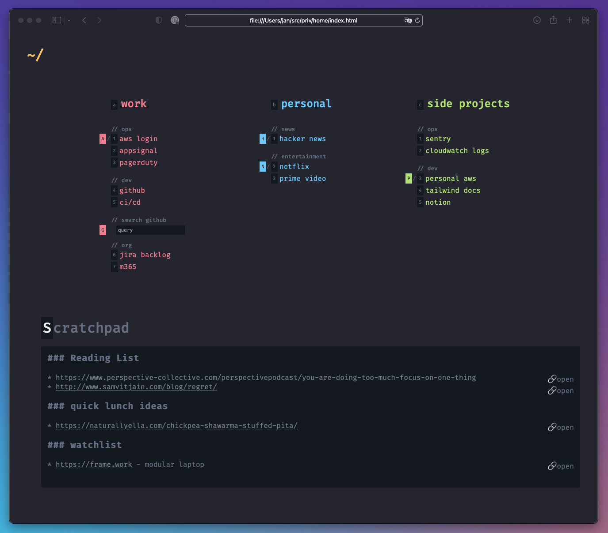

# `home`



This project provides you with a page that you can use as your "New Tab" or "Home" page in various browsers.

## Table of Contents

- [`home`](#home)
  - [Table of Contents](#table-of-contents)
  - [What does this do and how do I use it?](#what-does-this-do-and-how-do-i-use-it)
  - [Why?](#why)
  - [Installation](#installation)
    - [Google Chrome](#google-chrome)
    - [Non-Chrome browsers](#non-chrome-browsers)
  - [Customization](#customization)
    - [Categories](#categories)
      - [Adding Sub-Categories](#adding-sub-categories)
      - [Adding Links](#adding-links)
    - [Link Customization](#link-customization)
      - [Shortcuts / Special Links](#shortcuts--special-links)
        - [Input Fields / Quick search](#input-fields--quick-search)
    - [Themes](#themes)
    - [Scratchpad](#scratchpad)

## What does this do and how do I use it?

You can see a short GIF of the page in action [here](./docs/usage.gif).

The main focus is to provide a keyboard-driven experience to quickly access your frequently used websites. A markdown
scratchpad is also available to you, allowing you to quickly take notes by simply opening a new browser tab.

The page is divided into "categories". You can have as many categories as you'd like, but from personal experience (and
my poor understanding of flex) two or three categories work best.

Each category is assigned a letter automatically, starting at 'a'. You can select a category by pressing the assigned letter.
In each category, you can add as many links as you'd like. Links inside each categories will be assigned a number, starting at '1'.
Once you have selected a category using a letter, you can then press the number of the link that you want to access. The UI will
highlight your selections.
Once a link was selected, you will be taken to the linked page.

Some links are more important than others. For that reason, you can also assign a shortcut ("special link") to any uppercase letter.
This allows you to skip the selection of a category and immediately takes you to the link.

This page requires JavaScript to work.

## Why?

Mostly frustration. There are some really cool "new tab" pages out there, focused on productivity, showing reminders, or something else.
But what I really wanted was a keyboard-driven experience to quickly go places. At some point, I realized that I always have some sort of
note taking app open for quick notes, so the scratchpad was added.

People started asking me about this page whenever I shared my screen, so I decided to make it open source.
Since this started as a tiny side project, please don't expect the highest quality code :)

## Installation

1. Fork/Clone or [download](https://github.com/Rukenshia/home/archive/refs/heads/main.zip) this repository
2. Copy the example `index.html` to `index.private.html`
3. Add the page to your browsers' home/new tab page

### Google Chrome

Go to [Extension Settings](chrome://extensions), enable the developer mode and then at the top bar, import an unpacked extension.
When prompted for the directory, use this one.

### Non-Chrome browsers

Use the `index.private.html` page as your "new tab page".

## Customization

Please take a look at the newly copied `index.private.html`. It might already be somewhat self-explanatory and easier than starting from scratch.
You can find additional customization options and explanations below.

### Categories

A category is a group of links, accessed by a letter. You could categorize your links into different aspects of your life (like "work" and "private"), or if
you have a device solely for work you could split it into different things like "project mangement", "development", "operations".

To create a new category, you need to add a new `div` in the "categories" `div`:

```diff

    <div id="categories" class="row">
+      <div class="col red">
+        <div class="category">
+          <h2>work</h2>
+        </div>
+      </div>
    </div>
```

Each category is given a color. Available colors are `green`, `blue`, `red`, `purple`, and `yellow`.

#### Adding Sub-Categories

If you want to have some sub-groups inside of a category, you can add the following:

```diff
    <div id="categories" class="row">
      <div class="col red">
        <div class="category">
          <h2>work</h2>
        </div>

+        <h3 class="light subtitle">ops</h3>
      </div>
    </div>
```

#### Adding Links

Links are created by adding an unordered list with `<a>` elements in their list items:

```diff
    <div id="categories" class="row">
      <div class="col red">
        <div class="category">
          <h2>work</h2>
        </div>

        <h3 class="light subtitle">ops</h3>
+        <ul>
+          <li>
+            <a href="https://eu-central-1.console.aws.amazon.com">aws login</a>
+          </li>
+        </ul>
      </div>
    </div>
```

A number will be assigned to the link automatically.

### Link Customization

#### Shortcuts / Special Links

The `data-trigger` attribute can be used to immediately open a link:

```diff
    <div id="categories" class="row">
      <div class="col red">
        <div class="category">
          <h2>work</h2>
        </div>

        <h3 class="light subtitle">ops</h3>
        <ul>
-          <li>
+          <li data-trigger="A">
            <a href="https://eu-central-1.console.aws.amazon.com">aws login</a>
          </li>
        </ul>
      </div>
    </div>
```

##### Input Fields / Quick search

If you want to directly query a website, for example GitHub.com, you can add an input field with a `data-query` attribute in the list of links.
Please note that input fields currently do not support being assigned a number directly, so you need to use the `data-trigger` attribute too.

```diff
    <div id="categories" class="row">
      <div class="col red">
        <div class="category">
          <h2>work</h2>
        </div>

        <h3 class="light subtitle">ops</h3>
        <ul>
          <li data-trigger="A">
            <a href="https://eu-central-1.console.aws.amazon.com">aws login</a>
          </li>
        </ul>

        <h3 class="light subtitle">search github</h3>
+        <div class="only-special">
+          <input data-trigger="G" data-query="https://github.com/search?q={query}" type="text"
+            placeholder="query" />
+        </div>
      </div>
    </div>
```

The `data-query` attribute uses the `{query}` placeholder to place the text from your input in the URL.
Press the `Return` key to submit the search.

### Themes

You can customize the colors of this page by adding a theme. Please check out [`theme.ayu.css`](assets/css/theme.ayu.css) as an example. The theme can be switched at the
top of your `index.private.html`

### Scratchpad

This project uses the great [SimpleMDE](https://simplemde.com) editor to provide note-taking capabilities. **Scratchpad content is stored in your `localStorage` and might be wiped if you clean
up caches**. This also means that your notes are not shared between browsers or in incognito mode.

There is some additional functionality found in [scratchpad.js](./assets/js/scratchpad.js) that adds a "open link" annotation to the right of the scratchpad. If you don't want this, you can disable
it by changing the toggle at the top of the file.
